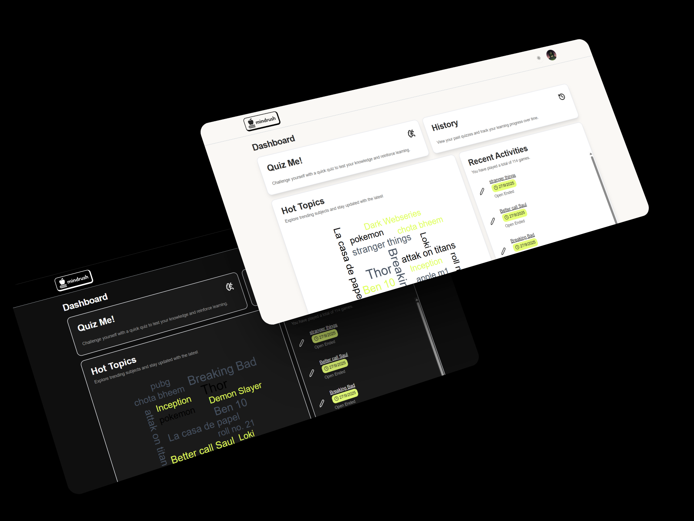
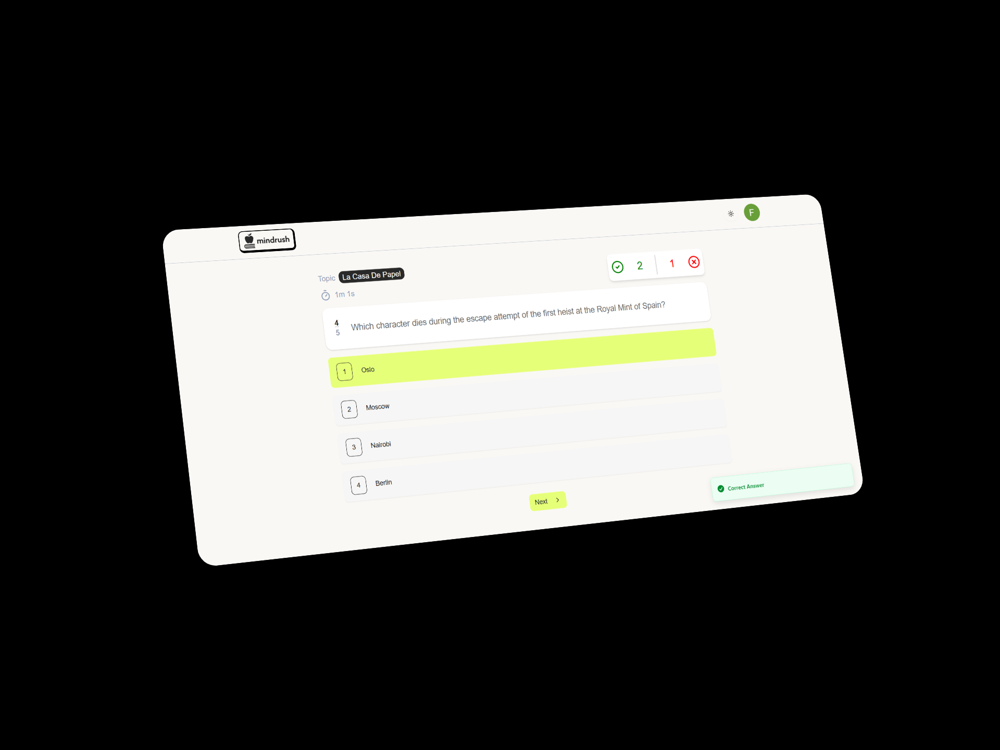
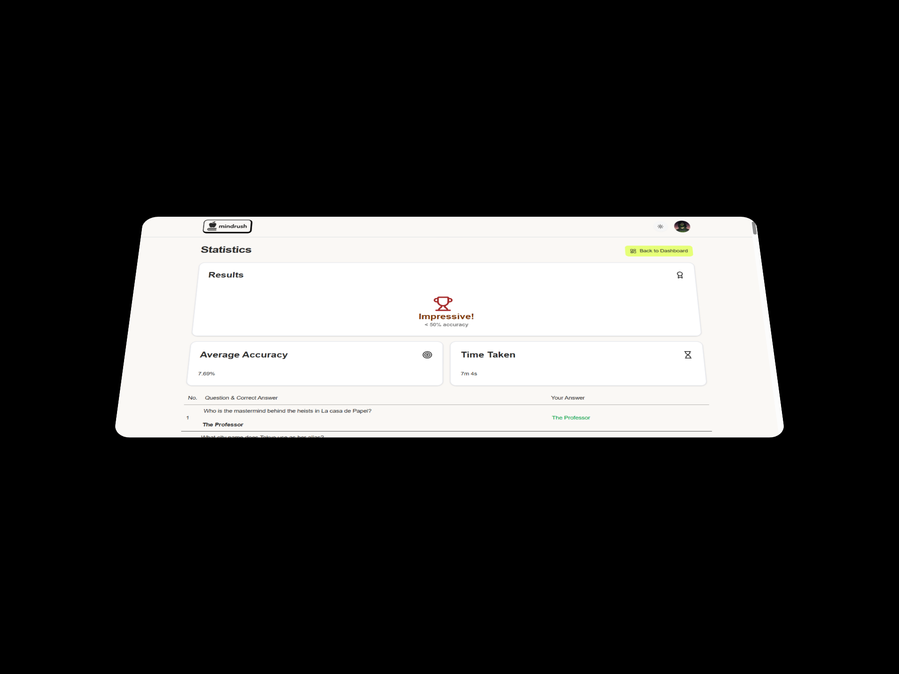

# AI Quiz Generator

AI Quiz Generator is an interactive web application that allows users to **create, take, and analyze quizzes** using AI-generated questions. Users can generate multiple-choice or open-ended quizzes on any topic, answer questions in real-time, and get detailed statistics about their performance. This project showcases fullstack development skills with **Next.js, React, Tailwind CSS, and Prisma**, and includes features like live timers, instant answer validation, and responsive design.

---

## Features

- **AI-Powered Quiz Generation:** Generate quizzes on any topic using AI. Supports multiple-choice and open-ended questions.
- **Real-Time Quiz Experience:**
  - Live timer while taking the quiz
  - Keyboard shortcuts to select answers and navigate questions
  - Visual progress tracking
- **Instant Feedback:** Correct and wrong answers are indicated immediately with toast notifications.
- **Statistics & Analytics:**
  - Track total time taken for a quiz
  - Correct vs Wrong answers breakdown
  - Detailed performance page for each quiz
- **Responsive Design:** Works seamlessly on desktop and mobile devices.
- **Persistent Data:** Quiz attempts, questions, and statistics are saved in the database for future reference.

---

## Tech Stack

- **Frontend:** React, Next.js, Tailwind CSS, Lucide Icons  
- **Backend:** Next.js API Routes, Node.js  
- **Database:** Prisma ORM with PostgreSQL  
- **Other:** Axios, React Query, Zod for validation, date-fns for time calculations, Sonner for toast notifications  

---

## Screenshots

### Home / Quiz Selection


### Quiz in Progress


### Statistics Page


---

## Getting Started

1. **Clone the repository**

```bash
git clone https://github.com/amandeep-singh-parihar/MindRush
cd mindrush
```

3. **Install dependencies**

```bash
npm install
```
3. **Setup environment variables**
<br/>
```bash
DATABASE_URL=""
DIRECT_URL=""
NEXTAUTH_SECRET=""
GOOGLE_CLIENT_ID=""
GOOGLE_CLIENT_SECRET=""
GEMINI_API_KEY=""
API_URL ="http://localhost:3000/"
```

4. **Run Prisma migrations**
```bash
npx prisma migrate dev
```

4. **Start the development server**
```bash
npm run dev
```
<br/>

**Contributions**

Contributions are welcome! If you want to improve the app, fix bugs, or add new features, feel free to open a pull request or submit an issue.

Steps to contribute:

1. Fork the repository

2. Create a new branch (git checkout -b feature/your-feature)

3. Make your changes and commit (git commit -m 'Add some feature')

4. Push to the branch (git push origin feature/your-feature)

5. Open a pull request